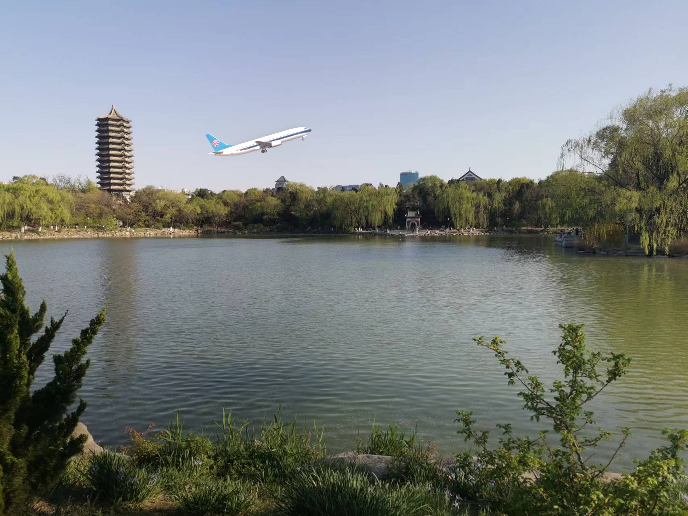

# 可视计算与交互概论 Tutorial for Lab 1 (2D Drawing)

## Lab 1 Overview

这次 Lab 中，大家将会实现前 8 讲中介绍的几种重要的算法或思想：

 1. 图像处理 中的 Dithering 算法 （[第七章讲义](https://vcl.pku.edu.cn/course/vci/notes/07-image-notes.pdf)P54-P59）

 2. 图像处理 中的 Image Filter 算法 （[第七章讲义](https://vcl.pku.edu.cn/course/vci/notes/07-image-notes.pdf)P61-P63）

 3. 图像处理 中的 Poisson Editing 算法 （[第七章讲义](https://vcl.pku.edu.cn/course/vci/notes/07-image-notes.pdf)P63-P67）

 4. 画图 中的 Bresenham 直线算法 （[第四章讲义](https://vcl.pku.edu.cn/course/vci/notes/04-scan-notes.pdf)P28-P31）
 
 5. 画图 中的 Scan Converting 三角形算法 （[第四章讲义](https://vcl.pku.edu.cn/course/vci/notes/04-scan-notes.pdf)P32-P33）
 
 6. 反走样 中的 Supersampling 算法 （[第五章讲义](https://vcl.pku.edu.cn/course/vci/notes/05-anti-aliasing-notes.pdf)P38-P39）
 
 7. 曲线 中的 de Casteljau 算法 （[第六章讲义](https://vcl.pku.edu.cn/course/vci/notes/06-curve-notes.pdf)P42-P44）

Lab1的任务比较多，但每个任务都不是很难。大家的任务是填补`Labs/1-Drawing2D/task.cpp`中的空缺部分，每一个函数对应一个任务。请务必**独立**完成自己的代码。

本次lab中需要使用`ImageRGB`类，该类的每一个实例即对应了一幅图像，具体用法可以参考给出的Task1中Threshold部分已经给出的代码，最后的附录也给出了一些使用示例及其numpy等价。大家也会用到`glm`数学库，这个库给出了许多向量、矩阵运算的API，比如`glm::ivec2`对应二维整数向量（本次lab中常用于表示位置），`glm::vec3`对应三维实数向量（本次lab中常用于表示颜色）。本次lab中不涉及到相关函数的调用，大家可以先熟悉一下用法，在之后的lab中会大量使用这个数学库。

下面分别介绍每个任务的目标。

## 评分

请提交实现完成的`tasks.cpp`文件，以及为本次lab写一份报告，包含实现的思路以及效果图。注意：请不要修改其它的源文件中的API！助教批改时只关注`tasks.cpp`文件的改动，擅自修改会导致无法正常编译！

Lab按每个Task的完成情况单独给分。本次Lab一共需要实现7个Task，2+1+1+1+1+0.5+0.5=7分（其中Task 3和Task 5作为bonus），此外报告占1分，因此合计8分（另有bonus2分）。

> Bonus分数可以用来抵消全部5个Lab中非Bonus部分的扣分（例如未能完成某个困难Task）。

## Task 1: Image Dithering (4*0.5'=2')


给定输入的灰色图像`input`（RGB三通道的值相同），使用不同的算法实现图像的Dithering，你需要修改`output`（函数的传引用参数）使得输出图片的每个像素只有全黑和全白两种颜色，且与输入图片尽量接近。每个算法的简要描述和结果如下：

### Threshold

灰度值在0.5以上的像素取1，灰度值在0.5以下的像素取0。实现在`void DitheringThreshold(ImageRGB & output, ImageRGB const & input)`函数里。这个函数作为API的参考提供给大家，不需要大家实现，最终输出如下：


### Uniform Random

给每个像素加上$[-0.5, 0.5]$中均匀分布的随机扰动，然后使用Threshold算法。请实现`void DitheringRandomUniform(ImageRGB & output, ImageRGB const & input)`函数。参考结果如下：


### Blue Noise Random

给每个像素加上蓝噪声的随机扰动，然后使用Threshold算法。蓝噪声的生成相对复杂，现在还是一个值得研究的问题（[Fast Poisson disk sampling in arbitrary dimensions](https://dl.acm.org/doi/10.1145/1278780.1278807)，[Blue-noise dithered sampling](https://dl.acm.org/doi/10.1145/2897839.2927430)）。我们提供了网络上的免费蓝噪声材质（[来源](http://momentsingraphics.de/BlueNoise.html)），感兴趣的同学也可以尝试自己生成：


请实现`void DitheringRandomBlueNoise(ImageRGB & output, ImageRGB const & input, ImageRGB const & noise)`函数。使用蓝噪声材质的参考结果如下：


### Ordered

使用3x3的有规律的黑白像素分布表示原图的一个灰度像素（[第七章讲义](https://vcl.pku.edu.cn/course/vci/notes/07-image-notes.pdf)P55-P56），因此Dithering之后的图像`output`宽高比`input`大3倍。请实现`void DitheringOrdered(ImageRGB & output, ImageRGB const & input)`函数，目标输出如下：


注意：你得到的效果不能相对原图始终偏亮/偏暗！

### Error Diffuse

用Floyd-Steinberg Error Diffusion算法（[第七章讲义](https://vcl.pku.edu.cn/course/vci/notes/07-image-notes.pdf)P57-P59）实现Dithering。请实现`void DitheringErrorDiffuse(ImageRGB & output, ImageRGB const & input)`，目标输出如下：


## Task 2: Image Filtering (2*1'=2')

使用3x3大小的卷积Kernel实现两种效果，图像模糊：`void Blur(ImageRGB & output,ImageRGB const & input)`，图像边缘提取：`void Edge(ImageRGB & output, ImageRGB const & input)`。效果如下：


## Task 3: Image Inpainting (bonus=1')

使用Poisson Editing算法将飞机图片贴到未名湖上空，补全`void Inpainting(ImageRGB & output, ImageRGB const & inputBack, ImageRGB const & inputFront, const glm::ivec2 & offset)`函数，其中`inputFront`为飞机，`inputBack`为背景，`offset`为飞机对应部分相对于背景图像顶点的偏移。直接粘贴的方式效果如下：


在使用了Poisson Editing算法之后（因为Jacobi迭代次数比较多可能比较慢）结果如下：



算法的实现方式是利用Jacobi迭代求解给定边界条件的Laplace方程$\nabla^2 g=0$，Jacobi迭代的代码已经给出，你需要将问题化简到Laplace方程的形式，由此得到$g$的表达式，在代码中填写边界处的结果。

## Task 4: Line Drawing (1')

用Bresenham算法绘制直线，实现`void DrawLine(ImageRGB &       canvas, glm::vec3 const color, glm::ivec2 const p0, glm::ivec2 const p1)`函数，其中`p0`,`p1`为端点，`color`为直线颜色。请注意需要实现各个斜率的情况，并注意代码的运行效率。实现结果如下图所示，并可以通过鼠标右键拖动两个端点：


## Task 5: Triangle Drawing (bonus=1')

任意给定平面中的三个点，绘制以这三个点为顶点的实心三角形。可以参考这个[课件](https://www.cs.princeton.edu/courses/archive/fall00/cs426/lectures/scan/sld004.htm)。实现任意一种算法即可。感兴趣的同学可以实现不同的算法比较运算效率。需要实现`void DrawTriangleFilled(ImageRGB & canvas, glm::vec3 const color, glm::ivec2 const p0, glm::ivec2 const p1, glm::ivec2 const p2)`函数，其中`p0`,`p1`,`p2`为顶点，`color`为三角形颜色。实现结果如下所示，并可以自由拖动三角形的三个端点：


## Task 6: Image Supersampling (0.5')

将一个大图缩小时可能发生Aliasing的情况，如下图所示（注意图像中西装领口部分不自然的条纹）：


Aliasing可以通过提高每个目标像素的采样率来减轻（即，每个目标像素值相当于其周围许多‘采样点’像素值的平均），这就是反走样最简单的算法Super Sampling Anti-Aliasing（SSAA），下图展示了5倍超采样的结果：


可以看到不自然的条纹减少了很多，图像也没有变得很模糊。请实现`void Supersample(ImageRGB & output, ImageRGB const & input, int rate)`函数，`rate`控制超采样率（每个维度上的‘采样点’分辨率相对输出图像的倍数，即：一个目标像素对应`rate*rate`个采样点），这样就能通过图像界面中的滑动条显示不同超采样率的结果。

提示：你可能需要使用**插值**

> 如果你发现在1倍采样的时候依然没有观察到Aliasing的现象，可能是因为你使用了高分辨率屏幕。可以尝试改小`CaseSSAA.cpp`中的图像大小再观察。

## Task 7: Bezier Curve (0.5')

给定四个控制点，使用德卡斯特里奥算法(de Casteljau's algorithm)算法，计算出贝塞尔曲线上点的位置，最终在屏幕上画出一条曲线。需要实现`glm::vec2 CalculateBezierPoint(std::span<glm::vec2> points, float const t)` ，其中`points`依次给出所有控制点，函数返回生成的曲线上参数为`t`时对应点的位置。你可以在 `CaseDrawBezier.h` 文件中自行更改控制点的数量（对应`_handles`变量），绘制出更高次的贝塞尔曲线。实现结果如下，跟之前一样可以拖动控制点的位置：


## Appendix: Usage of ImageRGB

注意：涉及到的颜色数值均是浮点类型，取值范围为 $[0,1]$.

+ 创建高180、宽320的全零图像

  ```cpp
  // cpp
  ImageRGB img(320, 180);
  ```

  ```python
  # numpy
  img = np.zeros((180, 320, 3), dtype=np.float32)
  ```

+ 创建高180、宽320的纯色图像

  ```cpp
  // cpp
  ImageRGB img = VCX::Labs::Common::CreatePureImageRGB(320, 180, { 0.5f, 0.5f, 0.5f });
  ```

  ```python
  # numpy
  img = np.ones((180, 320, 3), dtype=np.float32) * 0.5
  ```

+ 改用红色填充

  ```cpp
  // cpp
  ImageRGB img = VCX::Labs::Common::CreatePureImageRGB(320, 180, { 0.5f, 0.5f, 0.5f });
  img.Fill({ 1.0f, 0.0f, 0.0f });
  ```

  ```python
  # numpy
  img = np.ones((180, 320, 3), dtype=np.float32) * 0.5
  img[:, :] = (1.0, 0.0, 0.0)
  ```

+ 获取宽高

  ```cpp
  // cpp
  ImageRGB img = VCX::Labs::Common::CreatePureImageRGB(320, 180, { 0.5f, 0.5f, 0.5f });
  std::size_t width = img.GetSizeX();
  std::size_t height = img.GetSizeY();
  ```

  ```python
  # numpy
  img = np.ones((180, 320, 3), dtype=np.float32) * 0.5
  width = img.shape[1]
  height = img.shape[0]
  ```

+ 获取、打印和设置水平100像素、垂直180像素处的颜色

  ```cpp
  // cpp
  ImageRGB img(1024, 768);
  glm::vec3 color = img.At(100, 180); // get
  std::cout << color.r << ' ' << color.g << ' ' << color.b << std::endl; // print
  img.At(100, 180) = { 1.0f, 0.5f, 0.2f }; // set
  ```

  ```python
  # numpy
  img = np.zeros((768, 1024, 3), dtype=np.float32)
  color = img[180, 100] # get
  print(color[0], color[1], color[2]) # print
  img[180, 100] = (1.0, 0.5, 0.2) # set
  ```