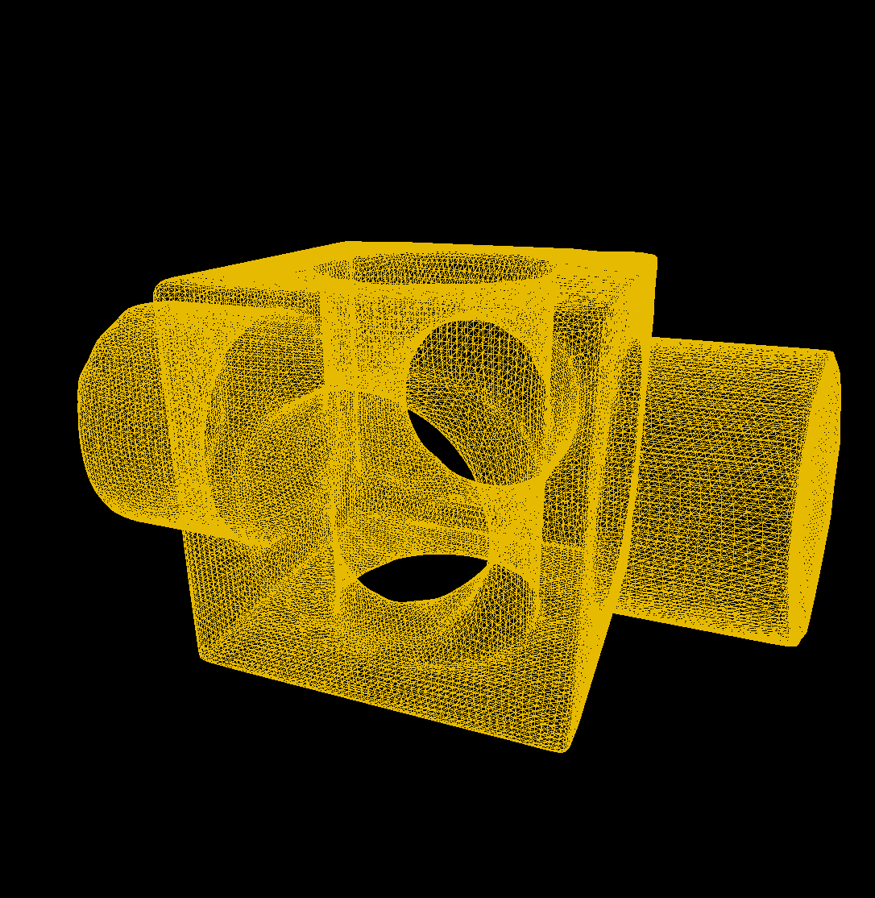
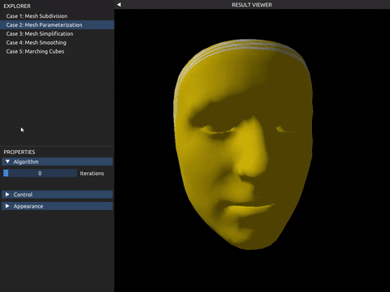
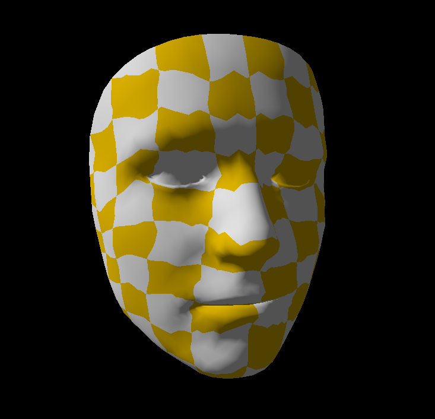
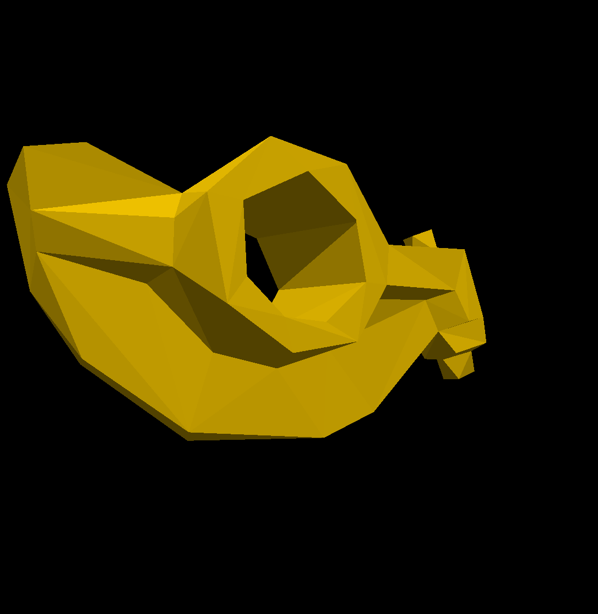
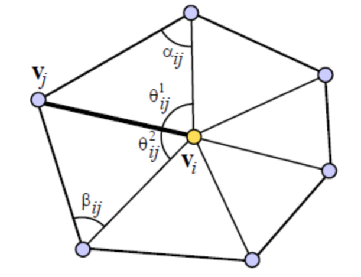
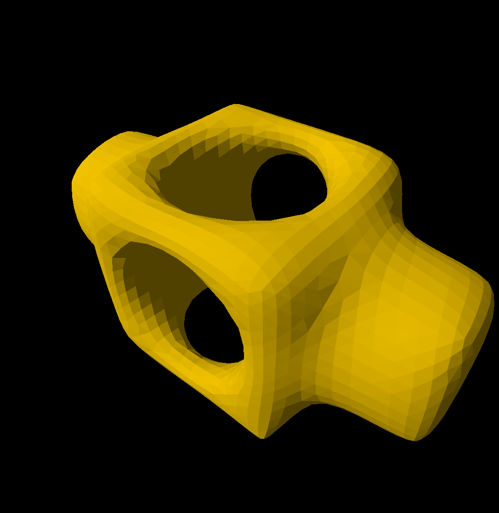
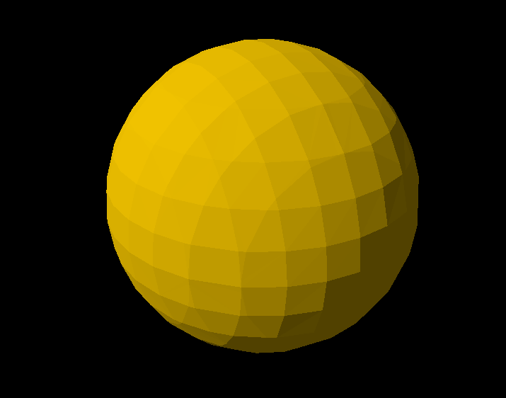
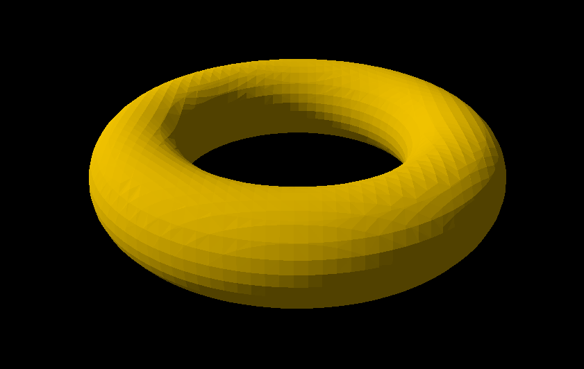
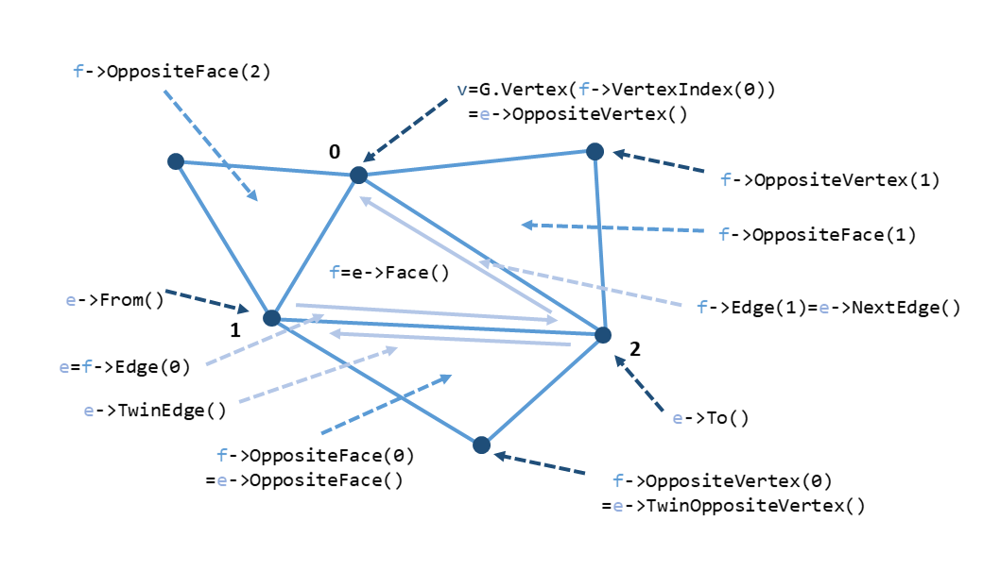

# 可视计算与交互概论 Tutorial for Lab 2 (Geometry Processing)

## Lab 2 Overview

这次 lab 中，大家将会实现几何处理部分介绍的几种重要的算法或思想：

 1. 几何表示中的 Loop Mesh Subdivision 算法 （[第八章讲义](https://vcl.pku.edu.cn/course/vci/notes/08-geometry-representation-notes.pdf)8.3节）
 2. 几何表示中的 Spring-Mass Mesh Parameterization 算法 （[第八章讲义](https://vcl.pku.edu.cn/course/vci/notes/08-geometry-representation-notes.pdf)8.4节）
 3. 几何处理中的 Mesh Simplification 算法 （[第十章讲义](https://vcl.pku.edu.cn/course/vci/notes/10-geometry-processing-notes.pdf)10.3节）
 4. 几何处理中的 Mesh Smoothing 算法 （[第十章讲义](https://vcl.pku.edu.cn/course/vci/notes/10-geometry-processing-notes.pdf)10.2节）
 5. 几何重建中的 Marching Cubes 算法 （[第十二章讲义](https://vcl.pku.edu.cn/course/vci/notes/12-geometry-reconstruction-notes.pdf)12.2.3节）

Lab 2 的算法难度会比 Lab 1 更高一些。大家的任务是填补 `src/VCX/Labs/2-GeometryProcessing/tasks.cpp` 中的空缺部分，每一个函数对应一个任务。请务必**独立**完成自己的代码。

说明：

  + 本次 lab 中的三角网格结构在 `Engine::SurfaceMesh` 中实现，你需要直接修改以下成员变量：
    + `Positions` 数组：给出每个顶点的位置。
    + `Indices` 数组：给出面的连接方式，具体来说，`Indices[3k], Indices[3k+1], Indices[3k+2]` 给出的顶点编号组成一个三角形。注意：顶点编号的顺序决定了面片的法线方向；如果你需要手动修改该数组，需要注意顶点编号的顺序，这会直接影响最后渲染出来的结果（见 `src/VCX/Engine/SurfaceMesh.cpp` 15 行）。
    + `TexCoords` 数组：给出每个顶点的纹理坐标，仅在第二个任务中需要使用到。

  + 本次 lab 中你需要使用到半边数据结构来处理三角网格，我们在 `src/VCX/Labs/2-GeometryProcessing/DCEL.hpp` 给出了一份双向边链表 [DCEL](https://en.wikipedia.org/wiki/Doubly_connected_edge_list) 的实现，详细说明请参见附录）。

  + 本次 lab 中你需要更广泛地使用到 glm 库的功能，我们在附录给出了使用教程。

  + 本次 lab 中涉及许多代码填空，请先阅读注释和已有代码理解它们的意图，以及理解代码填空部分需要完成的功能；尽管是代码填空，但是你仍然可以任意修改 `tasks.cpp` 内包括已有代码在内的全部内容，也就是说并不强制使用已经给出的代码、按照其思路来，你可以在已有代码的启发下自行决定如何实现算法。我们给出已有代码仅仅是为了降低难度。

下面分别介绍每个任务的目标。

## 评分

请提交实现完成的 `tasks.cpp` 文件，以及为本次 lab 写一份报告，包含实现的思路以及效果图。注意：对其他源文件的修改不会在批改时生效，助教批改时只关注 `tasks.cpp` 文件的改动。

Lab 按每个 Task 的完成情况单独给分。本次 lab 一共需要实现 5 个 Task，(2) + 1.5 + 2.5 + 1 + 2 = 7 + (2) 分（其中 Task 1 作为 bonus），此外报告占 1 分，因此合计 8 分（另有 bonus 2 分）。

> Bonus 分数可以用来抵消全部 5 个 lab 中非 Bonus 部分的扣分（例如未能完成某个困难 Task）。

## Task 1: Loop Mesh Subdivision (bonus=2')

请理解并实现课件中介绍的三角网格细分算法。算法来自于论文 [Smooth Subdivision Surfaces Based on Triangles](https://www.microsoft.com/en-us/research/wp-content/uploads/2016/02/thesis-10.pdf)（1987 年 Charles Teorell Loop 的硕士论文）。你需要实现 `void SubdivisionMesh(Engine::SurfaceMesh const & input, Engine::SurfaceMesh & output, std::uint32_t numIterations)` 函数，其中，`input` 和 `output` 分别为算法输入的网格和输出的网格，`numIterations`是细分操作迭代的次数。一次细分操作将在三角形网格每条边上产生一个新的顶点，如此将每一个三角形分割成更小的四个子三角形。新产生的顶点和原有的顶点将按照一定规则重新计算位置。大致算法流程如下：

1. 为当前 Mesh 建立半边数据结构；
2. 对于原有的每个顶点，将它们加入到新 Mesh 中，在新 Mesh 中重新计算它们的位置；
3. 遍历原有的每一条边，在边上产生新的顶点，计算它们的位置，并在新 Mesh 中连接顶点，形成新的面；
4. 重复 1~3 步，直到迭代次数达到上限。

我们提供了完整的代码注释和引导，请按照上述算法流程完成代码填空。

算法实现的结果如下（这是 block.obj 迭代两次的结果），将产生均匀而光滑的细分表面：



## Task 2: Spring-Mass Mesh Parameterization (1.5')

请理解并实现课件中介绍的基于弹簧质点的三角网格参数化算法。算法的更详细的介绍可以参考 SIGGRAPH 2008 年的 Course: [Mesh parameterization: theory and practice](https://dl.acm.org/doi/pdf/10.1145/1508044.1508091) 中的第二章。你需要实现 `void Parameterization(Engine::SurfaceMesh const & input, Engine::SurfaceMesh & output, const std::uint32_t numIterations)` 函数，其中 `numIterations` 是求解矩阵方程的迭代次数，输出的 `output` Mesh 的 TexCoords 应该保存每个顶点的 UV 坐标，**需要保证在 $[0, 1]^2$ 之内**。这里我们提供算法的大概流程供大家参考：

1. 为初始 `input` Mesh 建立半边数据结构，检查网格上的边界点（具体来说，只被一个三角形面包含的边，其两个端点被称为边界点）；
2. 初始化边界点上的 UV 坐标，可以选择初始化为正方形边界或者为圆边界；
3. 迭代求解中间点上的 UV 坐标，简单起见使用平均系数作为仿射组合系数，随后通过 Gauss-Seidel 迭代求解方程组。

我们提供了代码注释和引导，请按照上述算法流程完成代码填空。

算法实现的结果如下，在迭代到足够多步后 UV 坐标收敛，并且相对均匀地分布在人脸上：





提示：Gauss-Seidel 迭代求解 $Ax=b$ 时，每步迭代求解 $x$ 的第 $i$ 个分量时表达式形如：
$$
x_i^{(new)}=\frac{1}{a_{ii}}(b_i-\sum_{j=1}^{i-1}a_{ij}x_j^{(new)}-\sum_{j=i+1}^n a_{ij}x_j^{(old)})
$$
其中 $x_i^{(new)}$ 是经本轮迭代更新后的分量值。更多内容可以在网络上搜索[教程](https://zhuanlan.zhihu.com/p/389389672)，或参考数学专题部分的[线性系统专题](https://vcl.pku.edu.cn/course/vci/supplements/05-notes-cn.pdf)。另外也可以参考 Lab 1 中 Poisson Editing 部分如何使用 Gauss-Seidel 迭代求解矩阵方程。

## Task 3: Mesh Simplification (2.5')

请理解并实现课件中介绍的网格简化算法。算法来自于论文 [Surface Simplification Using Quadric Error Metrics](https://dl.acm.org/doi/pdf/10.1145/258734.258849) 。你需要实现 `void SimplifyMesh(Engine::SurfaceMesh const & input, Engine::SurfaceMesh & output, float simplification_ratio)` 函数，其中，`input` 和 `output` 分别为算法输入的网格和输出的网格，输入为水密网格，因此不用考虑边界边 (boundary edge)，`simplification_ratio` 是该简化算法保留顶点的比例 $(\in [0,1])$ 。这里给出大致的算法流程，同论文 4.1 节类似，但略有不同（具体来说，我们需要实现的算法只考虑已有边的坍缩，即论文 3.2 节中列出的两个坍缩条件，我们不考虑第二种 non-edge contraction 的情况，如论文图 2 所示）：

1. 按照论文第五节的说明，为每个初始顶点计算二次代价矩阵 $Q_i$ ；
2. 选择所有坍缩后仍然保持网格拓扑结构的顶点对，作为合法的顶点对；
3. 对于每一个合法的顶点对 $\text{v}_i, \text{v}_j$，求解最优的坍缩位置 $\bar{\text{v}}$ ，并计算它的代价 $\bar{\text{v}}^T(Q_i+Q_j)\bar{\text{v}}$ ；
4. 用数组保存这些顶点对，迭代地从中取出代价最小的那一对进行顶点合并操作，直到剩余顶点的数量小于所需的比例。

> 说明：我们对原算法进行调整是因为原算法不负责保持网格的拓扑结构和2-流形性质，容易出现网格的退化；在本次 lab 中我们需要实现的算法将保持网格拓扑结构。另外，关于第二步如何判断坍缩后是否保持网格拓扑结构，感兴趣可以参见 [补充材料](https://courses.cs.duke.edu/fall06/cps296.1/Lectures/sec-II-4.pdf) 37-38 页的说明，39 页最上方给出了判定方法，该方法实现在 `DCEL::IsConstractable` 中。

提示：解算最优的坍缩位置时，需要处理矩阵不可逆的情况，本次可以认为行列式绝对值小于千分之一即为不可逆。

我们提供了代码注释和引导，请按照上述算法流程完成代码填空。

算法实现的结果如下（这是 rocker.obj 在最高简化等级下的结果），将产生干净并且保持原先几何特征的简化表面：



## Task 4: Mesh Smoothing (1')

请理解并实现课件中介绍的网格平滑算法。算法是经典的 [Laplacian Smoothing](https://en.wikipedia.org/wiki/Laplacian_smoothing) 。你需要实现 `void SmoothMesh(Engine::SurfaceMesh const & input, Engine::SurfaceMesh & output, std::uint32_t numIterations, float lambda, bool useUniformWeight)` 函数，其中，`input` 和 `output` 分别为算法输入的网格和输出的网格，输入为水密网格，因此不用考虑边界边 (boundary edge)，`numIterations` 是平滑的迭代次数，`lambda` 是控制平滑率的参数，越大越平滑，`useUniformWeight` 决定是否使用 Uniform Laplacian（否则使用 Cotangent Laplacian）。算法大致流程如下：

1. 对每个顶点 $v_i$ ，计算相邻顶点位置的加权平均
   $$v_i'=\frac{\sum_{j\in N(i)}w_{ij} v_j}{\sum_{j\in N(i)} w_{ij}}$$
2. 其中使用 Uniform Laplacian 时 $w_{ij}=1$ ，使用 Cotangent Laplacian 时 $w_{ij}=\cot \alpha_{ij} + \cot \beta_{ij}$ ；
3. 更新顶点：$v_i=(1-\lambda)v_i+\lambda v_i'$ ；
4. 重复 1~3 步，直到迭代次数达到上限。

提示：
  1. 求解余切值时注意对异常余切值的处理（极大、极小）并检查任何可能除以零的操作以保证数值稳定。
  2. 对于余切权重为负的情况，可以自行选择：不处理；取绝对值；置零。



算法实现的结果如下（这是 block.obj 在 $\lambda = 0.5$ 下迭代 10 次的结果）：



## Task 5: Marching Cubes (2')

请理解并实现 Marching Cubes 算法将隐式表面转化为显式 Mesh 表示。你需要实现 `void MarchingCubes(Engine::SurfaceMesh & output, const std::function<float(const glm::vec3 &)> & sdf, const glm::vec3 & grid_min, const float dx, const int n)` 函数，各个参数的含义如下：

* `Engine::SurfaceMesh & output` ：输出的 Mesh
* `const std::function<float(const glm::vec3 &)> & sdf` ：隐式几何有符号距离场的函数，对于空间中的任意位置 `glm::vec3 pos`，可以调用 `sdf(pos)` 得到该点到隐式表面的有符号距离
* `const glm::vec3 & grid_min`, `const float dx`, `const int n` ：这三个参数定义了以 `grid_min` 为起始点，每个格子长度为 `dx`、XYZ 三个方向都向正方向延伸 n 个格子的背景网格

考虑到大家实现的方便，我们在 `marching_cubes_table.h` 中提供了 Marching Cubes 所需的两个表格：`c_EdgeStateTable` 和 `c_EdgeOrdsTable` ，可以在 `tasks.cpp` 中直接使用。它们的用法如下：首先需要计算一个 8 位的二进制数 `v`，第 `i` 位为 1 或 0 分别表示在立方体的第 `i` 个顶点处 sdf 为正或负；`c_EdgeStateTable[v]` 输出一个 12 位的二进制数，第 `i` 位表示立方体的第 `i` 条边上有无 mesh 的顶点；`uint32_t e0 = c_EdgeOrdsTable[v][3k], e1 = c_EdgeOrdsTable[v][3k+1], e2 = c_EdgeOrdsTable[v][3k+2]` 代表立方体的第 `e0,e1,e2` 条边上 mesh 的顶点应按顺序连接组成 mesh 上的一个三角形。

我们规定每个网格顶点和边的顺序如下，该顺序与表中的顺序相对应：


在这样的约定中，我们可以通过位运算得到每个顶点的位置。假设立方体 `v0` 顶点的位置为 `(x,y,z)`，则第 `i` 个顶点 `vi` 的位置为：

`(x + (i & 1) * dx, y + ((i >> 1) & 1) * dx, z + (i >> 2) * dx)`

第 `j` 条边 `ej` 的方向为 `unit(j >> 2)` ，其中 `unit()` 表示第几个方向的基矢，`unit(0) = (1,0,0)`，`unit(1) = (0,1,0)`，`unit(2) = (0,0,1)`。第 `j` 条边的起始点为 ：

`v0 + dx * (j & 1) * unit(((j >> 2) + 1) % 3) + dx * ((j >> 1) & 1) * unit(((j >> 2) + 2) % 3) `

算法的参考流程如下：
1. 为网格结构的边建立查询其上有无 mesh 顶点的数据结构；
2. 逐网格判断哪些边上有 mesh 的顶点；
3. 逐网格连接相应边上 mesh 的顶点，组成三角 mesh。

我们提供了球和环形的隐式表面，算法的生成结果如下，你也可以尝试自己定义隐式表面进行可视化：






## Appendix: Doubly-Connected-Edge-List

我们提供了一份DCEL数据结构的实现（在 `src/VCX/Labs/2-GeometryProcessing/DCEL.hpp` 中），具体来说用法如下：

```cpp
#include "Labs/2-GeometryProcessing/DCEL.hpp"

namespace VCX::Labs::GeometryProcessing {

    void Something(Engine::SurfaceMesh const & input) {
        DCEL G(input); // initialize

        if (! G.IsManifold()) {
            // we check if the mesh is 2-manifold
        }

        // for each vertex
        for (std::size_t i = 0; i < input.Positions.size(); ++i) {
            DCEL::VertexProxy const * v = G.Vertex(i); // get vertex with index i
            // do something with v
        }

        // for each edge
        for (DCEL::HalfEdge const * e : G.Edges()) {
            // do something with e
        }
    }

}

```

### DCEL G

+ `DCEL(faces)` ：构造函数，使用网格的面索引初始化；
+ `G.Vertex(idx)` ：根据顶点的索引获取相应的 `VertexProxy const *` 以便进一步查询（这些索引与初始化时绑定的顶点索引一一对应），如果曾经进行坍缩操作删除了该索引的顶点，返回 `nullptr` ；
+ `G.Face(idx)` ：根据面的索引获取相应的 `Triangle const *` 以便进一步查询（这些索引与初始化时绑定的面索引一一对应），如果曾经进行坍缩操作删除了该索引的面，返回 `nullptr` ；
+ `G.Edge(idx)` ：根据半边的索引获取相应的 `HalfEdge const *` 以便进一步查询（这些索引与初始化时绑定的半边索引一一对应），如果曾经进行坍缩操作删除了该索引的半边，返回 `nullptr` ；
+ `G.Faces()` ：获取所有的面（ `std::vector<Triangle const *>` ），以便进一步查询（这些面的顺序与初始化时传入的一致），如果曾经进行坍缩操作删除了面，这些面不会出现在其中；
+ `G.Edges()` ：获取所有的半边（ `std::vector<HalfEdge const *>` ），以便进一步查询（对于一对方向相反的半边，只会遍历其中一条），如果曾经进行坍缩操作删除了半边，这些半边不会出现在其中；
+ `G.IndexOf(edge)` ：获取某个半边（ `HalfEdge const *` ）在所有半边中的索引（从0开始计数）；
+ `G.IndexOf(face)` ：获取某个面（ `Triangle const *` ）在所有面中的索引（从0开始计数）；
+ `G.IsWatertight()` ：初始化所用的网格是否水密（不存在任何边界边且是2-流形），如果进行过坍缩操作；
+ `G.IsManifold()` ：初始化所用的网格是否是2-流形（不存在自相交、非流形顶点、非流形边）；
+ `G.DebugWatertightManifold()` ：重新检查当前的网格是否是水密2-流形（注意该操作非常耗时，仅用于调试），如果未曾进行过坍缩操作，则结果等同于 `G.IsWatertight && G.IsManifold()` ；
+ `G.DebugEdge(e)` ：打印和半边 `e` 相关的信息以显示其周围的拓扑结构，详见 `DCEL.hpp` 下 `DCEL` 类的 `void DebugEdge(HalfEdge const * edge, std::ostream & os = std::cout) const` 函数的开头注释，注意该操作非常耗时，仅用于调试；
+ `G.IsVertexRemoved(idx)` ：根据顶点的索引查询是否其被删除；
+ `G.IsFaceRemoved(idx)` ：根据面的索引查询是否其被删除；
+ `G.IsFaceRemoved(face)` ：根据面查询是否其被删除；
+ `G.NumOfVertices()` ：返回当前的顶点数量；
+ `G.NumOfFaces()` ：返回当前的面数量；
+ `G.IsConstractable(e)` ：对于水密的2-流形网格返回对边 `e` 进行坍缩操作是否保持了拓扑性质，对于其他网格始终返回 `false` ；
+ `G.Constract(e)` ：对边 `e` 进行坍缩操作，删除 `e->To()` 并更新 `e->From()` 的拓扑关系（该坍缩操作不会因为删除了顶点而重新对顶点索引进行映射，但请先确保这是水密的2-流形网格且该坍缩操作不改变拓扑性质），函数返回一个 `ConstractionResult` 结构体，包含了关于本次坍缩操作的细节信息，详见 `DCEL.hpp` 下 `DCEL` 类的 `ConstractionResult Constract(HalfEdge const * edge)` 函数的开头注释；
+ `G.ExportMesh()` ：返回当前网格的拓扑结构（只包含面索引属性），这些索引和初始的网格所使用的索引一致，即同一索引对应着同一个顶点。

> 关于2-流形和水密的说明可以参见[资料](https://davidstutz.de/a-formal-definition-of-watertight-meshes/)。

### DCEL::VertexProxy const * v

+ `v->OnBoundary()` ：是否是边界上的点；
+ `v->BoundaryNeighbors()` ：这个方法返回所有相邻顶点中边界点的索引（请先确保 `v` 是边界点）；
  + 在一个2-流形网格中，一个边界点有且只有两个相邻顶点也是边界点；
+ `v->Neighbors()` ：返回所有相邻顶点的索引；
+ `v->Ring()` ：返回所有相邻的面中与该顶点不相交的、相对的半边（对于非边界上的顶点，这些半边组成了一个环）；
+ `v->Faces()` ：返回所有相邻的面。

### DCEL::Triangle const * f

+ `f->VertexIndex(i)` ：返回第 `i` 个顶点的索引（`i`=0,1,2），这里的顶点顺序和初始化时传入的一致；
+ `f->Edge(i)` ：返回第 `i` 条边的半边结构（`i`=0,1,2），它是顶点 `i` 的对边；
+ `f->HasOppositeFace(i)` ：检查一个相邻的面是否存在，该相邻面与面 `f` 的共边就是 `f->Edge(i)` ；
+ `f->OppositeFace(i)` ：返回一个相邻的面，该相邻面与面 `f` 的共边就是 `f->Edge(i)`（请先检查这个面存在）；
+ `f->LabelOfVertex(idx)` ：根据顶点索引，返回这个顶点在面 `f` 中的序号（0,1,2），显然有 `f->VertexIndex(f->LabelOfVertex(idx)) == idx` ；
+ `f->HasVertex(idx)` ：根据顶点索引，检查这个顶点是否在面中；
+ `f->OppositeVertex(i)` ：返回一个相邻的面上某个顶点的索引，保证：
  + 该相邻面与面 `f` 的共边就是 `f->Edge(i)` ；
  + 返回的索引对应的顶点是该相邻面唯一不属于 `f` 的那个顶点。

### DCEL::HalfEdge const * e

+ `e->To()` ：这条半边指向的顶点的索引；
+ `e->From()` ：这条半边起点的索引；
+ `e->NextEdge()` ：在同一个三角形中，沿着同样方向的下一条半边（它的起点就是半边 `e` 指向的顶点）；
+ `e->PrevEdge()` ：在同一个三角形中，沿着同样方向的上一条半边（它指向的顶点就是半边 `e` 的起点）；
+ `e->TwinEdge()` ：和这条半边方向相反的半边（请先检查这个半边存在）；
+ `e->TwinEdgeOr(default_e)` ：和这条半边方向相反的半边（如果这个半边不存在，返回 `default_e` ）；
+ `e->OppositeVertex()` ：`e` 所在的面上，与 `e` 不相交的那个顶点的索引；
+ `e->Face()` ：半边所在的面结构；
+ `e->OppositeFace()` ：`e->TwinEdge()` 所在的面结构（请先检查 `e->TwinEdge` 存在）；
+ `e->TwinOppositeVertex()` ：`e->TwinEdge()` 所在的面上，与 `e->TwinEdge()` 不相交的那个顶点的索引（请先检查 `e->TwinEdge` 存在）；
+ `e->EdgeLabel()` ：`e` 在 `e->Face()` 中的序号 (0,1,2)，满足 `e == e->Face()->Edge(e->EdgeLabel())` 。



## Appendix: OpenGL Mathematics

### glm::vec3

+ 初始化左值

  ```c++
  // c++
  glm::vec3 color1 { 1.0f, 0.2f, 0.7f };   // assign each channel
  glm::vec3 color2 = { 1.0f, 0.2f, 0.7f }; // assign each channel
  glm::vec3 color3 { 0.6f };               // assign all channels
  glm::vec3 color4 = color3;               // clone
  ```

  ```python
  # numpy
  color1 = np.array([1.0, 0.2, 0.7], dtype=np.float32) # assign each channel
  color2 = np.array([1.0, 0.2, 0.7], dtype=np.float32) # assign each channel
  color3 = np.array([0.6] * 3, dtype=np.float32)       # assign all channels
  color4 = color3.copy()                               # clone
  ```

+ 初始化右值

  ```c++
  // c++
  glm::vec3 { 1.0f, 0.2f, 0.7f }; // assign each channel
  glm::vec3(1.0f, 0.2f, 0.7f);    // assign each channel
  glm::vec3(0.6f);                // assign all channels
  glm::vec3(color1);              // clone
  ```

  ```python
  # numpy
  np.array([1.0, 0.2, 0.7], dtype=np.float32) # assign each channel
  np.array([1.0, 0.2, 0.7], dtype=np.float32) # assign each channel
  np.array([0.6] * 3, dtype=np.float32)       # assign all channels
  color1.copy()                               # clone
  ```

+ 读取

  ```c++
  // c++
  color1.x;  // 1.0
  color1.r;  // 1.0
  color1.s;  // 1.0
  color1[0]; // 1.0
  
  color1.y;  // 0.2
  color1.g;  // 0.2
  color1.t;  // 0.2
  color1[1]; // 0.2
  
  color1.z;  // 0.7
  color1.b;  // 0.7
  color1.p;  // 0.7
  color1[2]; // 0.7
  ```

  ```python
  # numpy
  color1[0]; # 1.0
  color1[1]; # 0.2
  color1[2]; # 0.7
  ```

+ 赋值

  ```c++
  color2.x = 2.0f;               // assign single channel
  color2 = { 1.0f, 2.0f, 3.0f }; // assign all channels
  color2 = color1;               // clone
  ```

  ```python
  color2[0] = 2.0                # assign single channel
  color2[:] = (1.0, 2.0, 3.0)    # assign all channels
  color2[:] = color1;            # clone
  ```

+ 与 `glm::vec3` 之间的运算

  + 大部分能够在 `float` 之间进行的数值运算也能够在 `glm::vec3` 之间逐元素执行，例如 `+=` ，`*` ，`/=` 等；布尔运算符包含 `==` 和 `!=` ，但不支持大小关系比较。

+ 与 `float` 之间的运算

  + 加减乘除：`+` ，`-` ，`*` ，`/` ，`%` 。

+ 与 `int` 或 `double` 之间的运算

  + 全部不支持。


### glm::dvec3

+ 与 `glm::vec3` 基本行为一致，但基础数值类型从 `float` 改为 `double` ，因此也对应地只能和 `double` 、`glm::dvec3` 进行互相运算。

+ 与 `glm::vec3` 之间的互相转化：

  ```c++
  // c++
  glm::vec3  a { 1.0f, 2.0f, 3.0f };
  glm::dvec3 b { 2.0, 3.0, 4.0 };
  glm::dvec3 c { a }; // 1.0, 2.0, 3.0
  glm::vec3  d { b }; // 2.0f, 3.0f, 4.0f
  ```

  ```python
  # numpy
  a = np.array([1.0, 2.0, 3.0], dtype=np.float32)
  b = np.array([2.0, 3.0, 4.0], dtype=np.float64)
  c = a.astype(np.float64) # 1.0, 2.0, 3.0
  d = b.astype(np.float32) # 2.0, 3.0, 4.0
  ```


### glm::ivec3

+ 与 `glm::vec3` 基本行为一致，但基础数值类型从 `float` 改为 `int` ，因此也对应地只能和 `int` 、`glm::ivec3` 进行互相运算。
+ 与 `glm::vec3` 之间的互相转化类似 `glm::dvec3` 。


### glm::vec4

+ 与 `glm::vec3` 基本行为一致，但长度增加，在 `x,y,z` 、`r,g,b` 、`s,t,p` 这三组属性上，增加为 `x,y,z,w` 、`r,g,b,a` 、`s,t,p,q` ；最大索引也从 2 变为 3。

+ 与 `glm::vec3` 之间的互相转化：

  ```c++
  // c++
  glm::vec3  a { 1.0f, 2.0f, 3.0f };
  glm::vec4  b { 2.0f, 3.0f, 4.0f, 5.0f };
  glm::vec4  c { a, 7.0f }; // 1.0f, 2.0f, 3.0f, 7.0f
  glm::vec3  d { b };       // 2.0f, 3.0f, 4.0f
  ```

  ```python
  # numpy
  a = np.array([1.0, 2.0, 3.0], dtype=np.float32)
  b = np.array([2.0, 3.0, 4.0, 5.0], dtype=np.float32)
  c = np.append(a, 7.0) # 1.0, 2.0, 3.0, 7.0
  d = b[:3]             # 2.0, 3.0, 4.0
  ```


### Summary of Vector Type

+ 任意向量都具有一种数值类型（ `int` ，`float` ，`double` 等）和一个固定长度（1~4）；
+ 任意向量都可以和它对应的数值类型进行四则运算，与其他任何数值类型的任何运算都不支持；
+ 任意向量之间的运算只有在数值类型和长度都一致的情况下才能进行，否则任何运算都不支持；
+ 任何同样长度不同数值类型的向量之间都可以进行互相转化，类似 `glm::vec3` 和 `glm::dvec3` ；
+ 任何不同长度同样数值类型的向量之间都可以进行互相转化，类似 `glm::vec3` 和 `glm::vec4` 。


### glm::mat3

+ 初始化左值

  ```c++
  // c++
  
  // [[0.0f, 3.0f, 6.0f],
  //  [1.0f, 4.0f, 7.0f],
  //  [2.0f, 5.0f, 8.0f]]
  glm::mat3 m1 { 0.0f, 1.0f, 2.0f, 3.0f, 4.0f, 5.0f, 6.0f, 7.0f, 8.0f };
  glm::mat3 m2 = { 0.0f, 1.0f, 2.0f, 3.0f, 4.0f, 5.0f, 6.0f, 7.0f, 8.0f };
  
  // [[2.0f, 0.0f, 0.0f],
  //  [0.0f, 2.0f, 0.0f],
  //  [0.0f, 0.0f, 2.0f]]
  glm::mat3 m3 { 2.0f };
  
  // [[0.0f, 3.0f, 6.0f],
  //  [1.0f, 4.0f, 7.0f],
  //  [2.0f, 5.0f, 8.0f]]
  glm::mat3 m4 {
      glm::vec3(0.0f, 1.0f, 2.0f),
      glm::vec3(3.0f, 4.0f, 5.0f),
      glm::vec3(6.0f, 7.0f, 8.0f)
  };
  
  // [[0.0f, 3.0f, 6.0f],
  //  [1.0f, 4.0f, 7.0f],
  //  [2.0f, 5.0f, 8.0f]]
  glm::mat3 m5 {
      glm::dvec3(0.0, 1.0, 2.0),
      glm::dvec3(3.0, 4.0, 5.0),
      glm::dvec3(6.0, 7.0, 8.0)
  };
  ```

+ 初始化右值

  ```c++
  // c++
  
  // [[0.0f, 3.0f, 6.0f],
  //  [1.0f, 4.0f, 7.0f],
  //  [2.0f, 5.0f, 8.0f]]
  glm::mat3 { 0.0f, 1.0f, 2.0f, 3.0f, 4.0f, 5.0f, 6.0f, 7.0f, 8.0f };
  glm::mat3(0.0f, 1.0f, 2.0f, 3.0f, 4.0f, 5.0f, 6.0f, 7.0f, 8.0f);
      
  // [[2.0f, 0.0f, 0.0f],
  //  [0.0f, 2.0f, 0.0f],
  //  [0.0f, 0.0f, 2.0f]]
  glm::mat3 { 2.0f };
  glm::mat3(2.0f);
  
  // [[0.0f, 3.0f, 6.0f],
  //  [1.0f, 4.0f, 7.0f],
  //  [2.0f, 5.0f, 8.0f]]
  glm::mat3 {
      glm::vec3(0.0f, 1.0f, 2.0f),
      glm::vec3(3.0f, 4.0f, 5.0f),
      glm::vec3(6.0f, 7.0f, 8.0f)
  };
  glm::mat3(
      glm::vec3(0.0f, 1.0f, 2.0f),
      glm::vec3(3.0f, 4.0f, 5.0f),
      glm::vec3(6.0f, 7.0f, 8.0f)
  );
  ```

+ 读写

  ```c++
  // c++
  glm::mat3 m { 1.0f };
  m[i][j]; // -> float @ (col i, row j)
  m[i];    // -> glm::vec3 @ (col i)
  ```

  ```python
  # numpy
  m = np.eye(3, dtype=np.float32)
  m[j,i]  # -> float @ (col i, row j)
  m[:, i] # -> vec3 @ (col i)
  ```

+ 与 `glm::mat3` 之间的运算

  + 大部分能够在 `float` 之间进行的数值运算也能够在 `glm::mat3` 之间逐元素执行，例如 `+=` ，`*` ，`/=` 等，**这些运算都是定义在矩阵上的，也就是说，对于加法和减法是逐元素进行，对于乘法是矩阵乘（而非逐元素乘），对于除法是乘以另一矩阵的逆（而非逐元素除）**；布尔运算符包含 `==` 和 `!=` ，但不支持大小关系比较。

+ 与 `glm::vec3` 之间的运算

  + 支持 `*` 操作，进行矩阵乘法，返回结果也是 `glm::vec3` 类型。

+ 与 `float` 之间的运算

  + 加减乘除：`+` ，`-` ，`*` ，`/` 。

+ 与 `int` 或 `double` 之间的运算

  + 全部不支持。


### glm::mat4

+ 与 `glm::mat3` 基本行为一致，对应地，可以与 `glm::mat4` 、`glm::vec4` 进行运算。

+ 与 `glm::mat3` 之间的互相转化：「多截少补」原则，多出来的部分截去，缺少的部分补零。

  ```c++
  // c++
  
  // [[0.0f, 3.0f, 6.0f],
  //  [1.0f, 4.0f, 7.0f],
  //  [2.0f, 5.0f, 8.0f]]
  glm::mat3 m1 { 0.0f, 1.0f, 2.0f, 3.0f, 4.0f, 5.0f, 6.0f, 7.0f, 8.0f };
  
  // [[1.0f, 2.0f, 3.0f, 4.0f],
  //  [1.0f, 2.0f, 3.0f, 4.0f],
  //  [1.0f, 2.0f, 3.0f, 4.0f],
  //  [1.0f, 2.0f, 3.0f, 4.0f]]
  glm::mat4 m2 { glm::vec4(1.0f), glm::vec4(2.0f), glm::vec4(3.0f), glm::vec4(4.0f) };
  
  // [[0.0f, 3.0f, 6.0f, 0.0f],
  //  [1.0f, 4.0f, 7.0f, 0.0f],
  //  [2.0f, 5.0f, 8.0f, 0.0f],
  //  [0.0f, 0.0f, 0.0f, 0.0f]]
  glm::mat4 m3 { m1 };
  
  // [[1.0f, 2.0f, 3.0f],
  //  [1.0f, 2.0f, 3.0f],
  //  [1.0f, 2.0f, 3.0f]]
  glm::mat3 m4 { m2 };
  ```


### General Operation

+ `glm::sqrt(x)` ：对单个数值、向量或矩阵逐元素取平方根；
+ `glm::abs(x)` ：对单个数值、向量或矩阵逐元素取绝对值；
+ `glm::sin(x)` ：对单个数值、向量或矩阵逐元素取正弦函数（按弧度）；
+ `glm::clamp(x, min_val, max_val)` ：对单个数值、向量或矩阵逐元素裁剪到 $[\text{min\_val},\text{max\_val}]$ 范围内；
+ `glm::max(a, b)` ：对单个数值、向量或矩阵逐元素取两个参数中的最大者；
+ `glm::min(a, b)` ：对单个数值、向量或矩阵逐元素取两个参数中的最小者。


### Linear Algebra Operation

+ `glm::normalize(v)` ：返回非零向量归一化为单位向量的结果；
+ `glm::inverse(m)` ：返回可逆方阵的逆；
+ `glm::determinant(m)` ：返回方阵的行列式值；
+ `glm::cross(va, vb)` ：返回向量的叉积；
+ `glm::dot(va, vb)` ：返回向量的点积；
+ `glm::transpose(m)` ：返回矩阵的转置。