# 可视计算与交互概论 Tutorial for Lab 3 (Rendering)

## Lab 3 Overview

本次 Lab 中，大家将会实现渲染部分介绍的几种重要的算法或思想：

 1. Phong/Blinn-Phong 光照模型 （[第十二章讲义](https://vcl.pku.edu.cn/course/vci/notes/12-shading-notes.pdf)12.3节）
 2. 实时渲染中的环境映射技术 （[第十五章讲义](https://vcl.pku.edu.cn/course/vci/notes/15-texture-notes.pdf)15.4节）
 3. 非真实感渲染 （[第十二章讲义](https://vcl.pku.edu.cn/course/vci/notes/12-shading-notes.pdf)12.6节）
 4. 实时渲染中的阴影映射技术 （[第十五章讲义](https://vcl.pku.edu.cn/course/vci/notes/15-texture-notes.pdf)15.4节）
 5. 光线追踪离线渲染框架 （[第十四章讲义](https://vcl.pku.edu.cn/course/vci/notes/14-ray-tracing-notes.pdf)14.1和14.2节）

Lab 3 中同学们将自己动手完成一个渲染器的构建。大家的任务是填补 `Labs/3-Rendering/tasks.cpp` 以及 `Labs/3-Rendering/shaders/*.*` 中的空缺部分，请参考下述具体任务的介绍。请务必**独立**完成自己的代码。

本次 lab 的前 4 个任务均需大家使用 GLSL 完成对 OpenGL 着色器的代码填空，这四个任务均只需填写几行代码，因此请大家不必担心。在本次 lab 中，我们已经写好了相应的状态设置函数和状态使用函数，它们为渲染的各个阶段做好了准备工作；同学们需要完成的着色器则对应图形渲染管线中一个个具体阶段的任务。

GLSL 是 OpenGL 的着色器语言，这里给出一些关于[基本语法](https://learnopengl-cn.github.io/01%20Getting%20started/05%20Shaders/)和[着色器工作流程](https://learnopengl-cn.github.io/01%20Getting%20started/04%20Hello%20Triangle/)的资料。

## 评分

请提交实现完成的 `tasks.cpp` 文件和 `shaders` 文件夹（如果你完成了 Task 5 的额外任务，也需要提交 `tasks.h` 文件），以及为本次 lab 写一份报告，包含实现的思路以及效果图。注意：对其他源文件的修改不会在批改时生效，助教批改时只关注上述文件的改动。

Lab 按每个 Task 的完成情况单独给分。本次 lab 一共需要实现 5 个 Task，2 + 1 + 1.5 + 1.5 + 2 = 8 分（其中 Task 1 包含额外的 bonus 任务 1.5 分，Task 5 包含额外的 bonus 任务 2.5 分）；此外每个 Task 可能要求在报告中回答问题，这些问题所占的分数已包含在 Task 中，因此合计 8 分（另有 bonus 4 分）。

> Bonus 分数可以用来抵消全部 5 个 lab 中非 Bonus 部分的扣分（例如未能完成某个困难 Task）。

## Task 1: Phong Illumination (1.5', bonus=1.5')

请理解并实现讲义中介绍的 Phong 光照模型。你需要实现 `shaders/phong.frag` 中的 `shade()` 函数，该函数分别接收光照、光线方向（从物体表面指向光源）、表面法向（指向物体外部）、视角方向（从物体表面指向相机位置）、漫反射颜色、高光颜色及光泽度，计算出着色结果并输出。

在 Phong 模型的基础上有 Blinn-Phong 模型的改进，主要区别在于镜面反射高光的计算，Blinn-Phong 的高光会更柔和。请参考[知乎](https://zhuanlan.zhihu.com/p/352209183)、[Wikipedia](https://en.wikipedia.org/wiki/Blinn%E2%80%93Phong_reflection_model)学习 Blinn-Phong 模型。在我们的 shader 代码中，全局变量 `u_UseBlinn` 控制光照模型的选择，当为 `true` 时 `shade()` 应返回 Blinn-Phong 模型的着色结果，否则应返回 Phong 模型的着色结果。

完成 Phong/Blinn-Phong 光照模型并撰写报告即可获得本任务的全部分数（标答只有三行代码）。一些常用的 GLSL 函数包括 `max,dot,normalize,pow` 等。Phong 光照算法实现的结果如下：

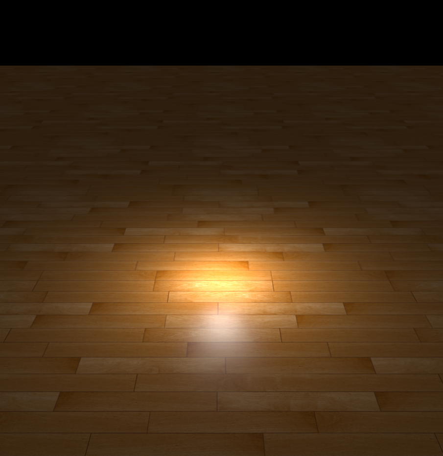

Blinn-Phong 光照算法实现的结果如下：

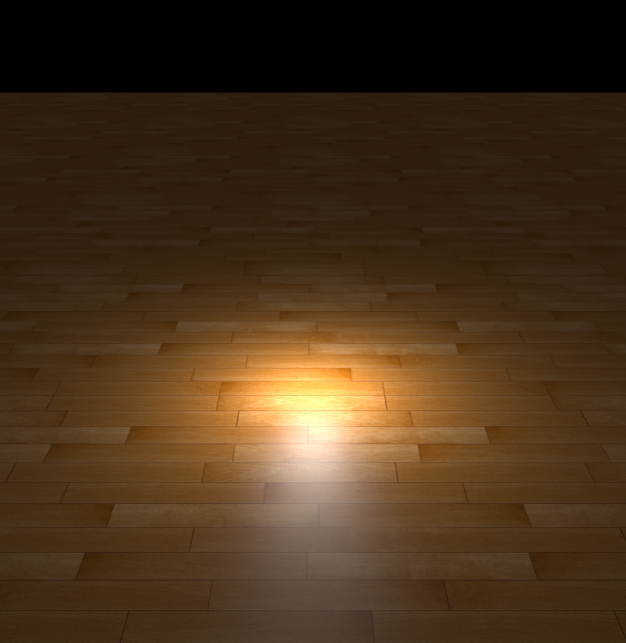

在完成这个任务的同时，请在报告中回答下列问题：
1. 顶点着色器和片段着色器的关系是什么样的？顶点着色器中的输出变量是如何传递到片段着色器当中的？
2. 代码中的 `if (diffuseFactor.a < .2) discard;` 这行语句，作用是什么？为什么不能用 `if (diffuseFactor.a == 0.) discard;` 代替？

`shaders/phong.frag` 中的 `GetNormal()` 函数当前只返回根据顶点法向量插值后的结果，一个可能的提升是利用 `u_HeightMap` 实现凹凸映射 (bump mapping)。完成该任务的同学可获得 bonus 1.5 分。可参考 https://gamedev.stackexchange.com/questions/174642/how-to-write-a-shader-that-only-uses-a-bump-map-without-a-normal-map 或其它互联网资料。算法实现的结果如下（这是 sibenik 场景的渲染图）：

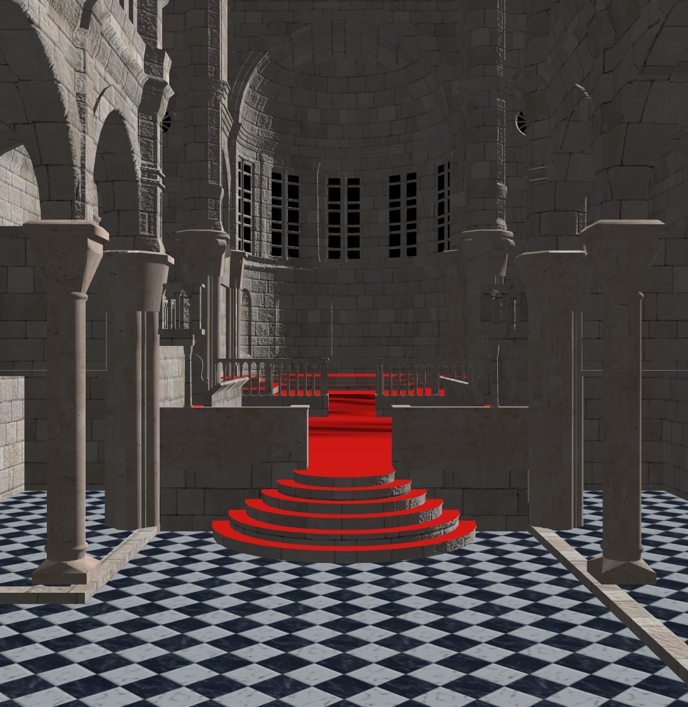

## Task 2: Environment Mapping (1')

请理解并实现立方体贴图及环境映射的相关原理。参考资料（后者是前者的中文翻译）：
1. https://learnopengl.com/Advanced-OpenGL/Cubemaps
2. https://learnopengl-cn.github.io/04%20Advanced%20OpenGL/06%20Cubemaps/
你需要实现 `shaders/skybox.vert` 中计算 `gl_Position` 的相关代码，以及 `shaders/envmap.frag` 中进行环境贴图采样的相关代码（提示：可采用 GLSL 内置的 `texture()` 和 `reflect()` 函数）。

算法实现的结果如下（这是 teapot 场景的渲染图）：

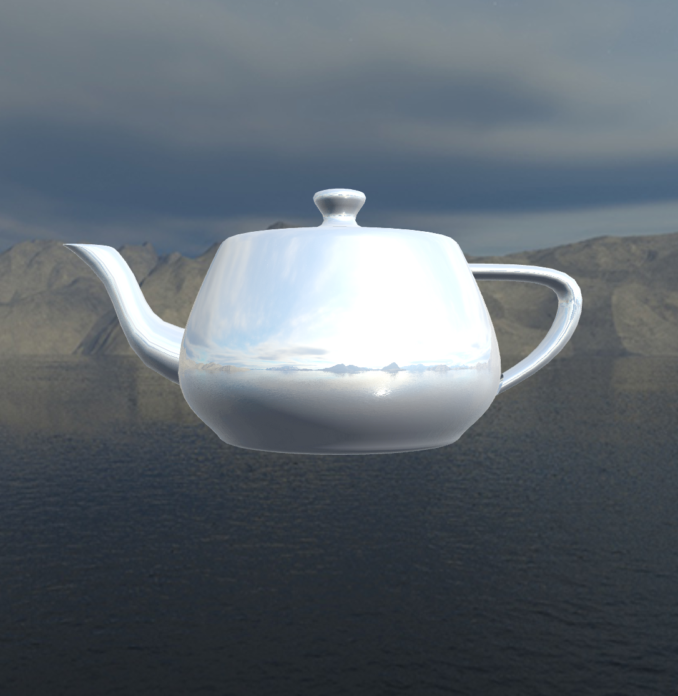

## Task 3: Non-Photorealistic Rendering (1.5')

在这个任务中，我们实现一个最基础的非真实感渲染算法，效果如下：

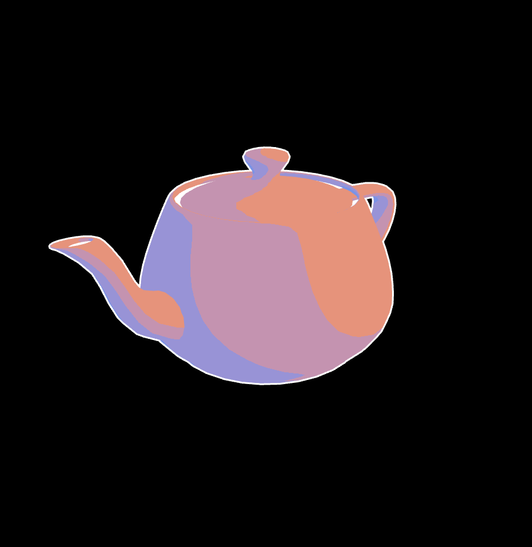

可以注意到渲染结果中有白色的轮廓线，从冷色到暖色的过渡，并且有卡通效果的颜色分界线。这样的效果需要两组 shader 来实现，第一组shader `npr-line.vert` 和 `npr-line.frag` 实现了白色轮廓线的渲染。实现的方法是讲义 12.6 节的做法，我们将模型的背面用纯白色渲染，并且稍微扩大一点，再叠加上模型的正面，这样就获得了模型外侧的轮廓线。这部分的代码我们直接提供给大家，请大家尝试理解代码的含义。第二组 shader `npr.vert` 和 `npr.frag` 实现了正面的颜色渲染，采用的方法为 Gooch Shading 。这部分需要大家实现 `npr.frag` 中的 `Shade()` 函数，计算每个像素的颜色。输入 `vec3 lightDir` 为指向光源的方向，`vec3 normal` 为表面法向。全局变量 `u_CoolColor` 和 `u_WarmColor` 为 Gooch Shading 中的冷色和暖色。

这部分我们不要求同学们实现的效果跟示例完全一致，只要接近即可，甚至也可以实现完全不同的艺术风格。在完成这个任务的同时，请在报告中回答下面的问题：

1. 代码中是如何分别渲染模型的反面和正面的？（答案在 `Labs/3-Rendering/CaseNonPhoto.cpp` 中的 `OnRender()` 函数中）
2. `npr-line.vert` 中为什么不简单将每个顶点在世界坐标中沿着法向移动一些距离来实现轮廓线的渲染？这样会导致什么问题？

## Task 4: Shadow Mapping (1.5')

在这个任务中，我们实现点光源和有向光源的阴影效果，如下：

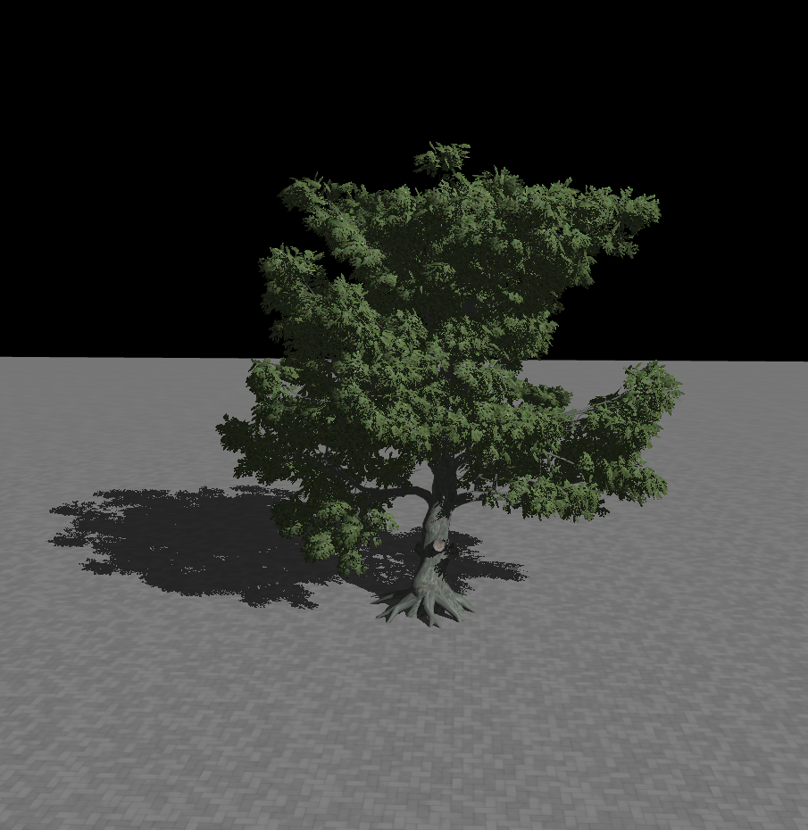

在课上我们简要介绍了在光栅化中如何实现阴影：在Phong Shading的基础上，当检测到表面点到光源的连线中间被其他三角形遮挡时，就认为当前点在阴影中从而不计算光源的影响；而遮挡的检测，是通过在光源位置渲染出一张深度图作为材质保存下来，称为 阴影贴图 (Shadow Map)，当距离光源的距离大于材质记录的深度时就发生了遮挡。更详细的讲解可以参考下面两个链接：

1. https://learnopengl-cn.github.io/05%20Advanced%20Lighting/03%20Shadows/01%20Shadow%20Mapping/
2. https://learnopengl-cn.github.io/05%20Advanced%20Lighting/03%20Shadows/02%20Point%20Shadows/

与这个任务相关的 shader 比较多，但是只需要同学们补全其中的两个，每个只需要添加最多**两行代码**：`shadowmap.vert` 和 `shadowmap.frag` 用于生成有向光源的阴影贴图，`phong-shadow.vert` 和 `phong-shadow.frag` 用于在 Shading 中使用有向光源的阴影贴图计算光照；`shadowcubemap.vert` 、 `shadowcubemap.geom` 和 `shadowcubemap.frag` 用于生成点光源的阴影贴图，`phong-shadowcubemap.vert` 和 `phong-shadowcubemap.frag` 用于在 Shading 中使用点光源的阴影贴图计算光照；我们将用于生成阴影贴图的 shader 提供给大家，请大家阅读并理解生成阴影贴图的过程。需要同学们补全 `phong-shadow.frag` 和 `phong-shadowcubemap.frag` 这两个 shader。请首先将 Task 1 中的 `Shade()` 函数拷贝到这两个shader中，然后补全 `Shadow()` 函数。

在阅读和补全代码的过程中，请在报告中回答下面的问题：

1. 想要得到正确的深度，有向光源和点光源应该分别使用什么样的投影矩阵计算深度贴图？
2. 为什么 `phong-shadow.vert` 和 `phong-shadow.frag` 中没有计算像素深度，但是能够得到正确的深度值？

## Task 5: Whitted-Style Ray Tracing (2', bonus=2.5')

请阅读并理解讲义中介绍的 Ray Tracing 算法。这个算法来自 1980 年 Whitted 提出的反复执行 Ray Casting 的思想，因此又被称为 Whitted-Style Ray Tracing ，这一算法也是现在渲染领域光线追踪技术的雏形。

你需要先实现 `tasks.cpp` 中 `bool IntersectTriangle(Intersection & output, Ray const & ray, glm::vec3 const & p1, glm::vec3 const & p2, glm::vec3 const & p3)` 函数。这个函数求光线 `ray` 与三角形 `(p1, p2, p3)` 之间的交点，如果交点存在，在 `output` 中设置交点与光线原点的距离 `t` 以及交点在三角形中的质心坐标 `(u, v)` 并返回 `true` ；否则返回 `false` 。这里定义的质心坐标与纹理映射讲义中的符号略有不同，`(u, v)` 满足对于三角形内任意一点 `p` ， `p = (1-u-v)*p1 + u*p2 + v*p3` ，其中各项系数都大于0. 光线求交算法的实现不要求与上课所讲方法一致，同学们可以自行调研实现不同的算法。部分参考资料如下：

1. [Fast, minimum storage ray/triangle intersection](https://dl.acm.org/doi/10.1145/1198555.1198746)
2. [Plücker Coordinate Tutorial](http://www.realtimerendering.com/resources/RTNews/html/rtnv11n1.html#art3)

完成上面的函数之后，请根据对 Ray Tracing 算法的理解，阅读并填补 `task.cpp` 中光线追踪函数 `RayTrace` 中的着色部分。光线与场景求交形成的位置、法向、反照率、吸收率、透明度、高光衰减指数都已在函数内给出。在完成着色部分之后，阅读讲义中 Shadow Ray 的思想，最后在光线追踪中实现阴影。你可以使用 `auto hit = intersector.IntersectRay(Ray(pos, dir));` 语句来对光线求交；为了简化实现，在计算阴影过程中，如果光源与着色点之间存在遮挡物，近似认为 `alpha < 0.2` 的遮挡物视为透明，而 `alpha >= 0.2` 的遮挡物视为不可透过。这里透明度 `alpha = hit.IntersectAlbedo.w` 。无阴影的场景（以 3 次反射、无超采样的 Cornell Box 为例）示例如下：

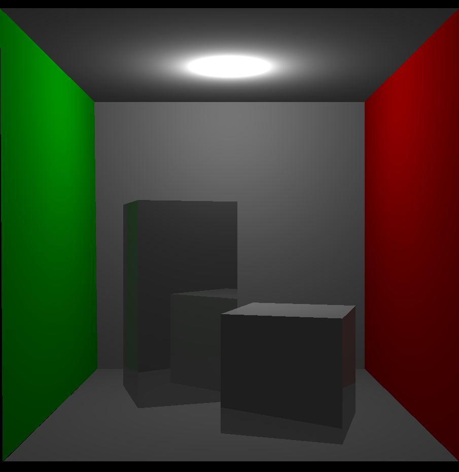

有阴影的场景示例如下：

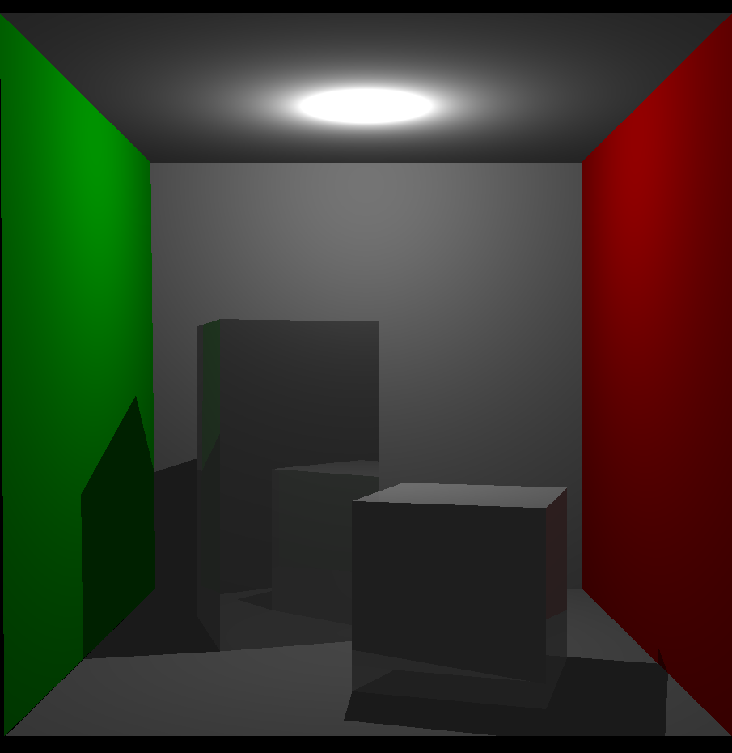

在阅读和补全代码的过程中，请在报告中回答下面的问题：

1. 光线追踪和光栅化的渲染结果有何异同？如何理解这种结果？

完成这个任务的过程中，你可能会注意到光线追踪的渲染速度根据场景大小变化显著，对后面几个较大的场景甚至无法在合理的时间内完成渲染。这是因为 `task.h` 中给出的 `TrivialRayIntersector` 在每次光线求交时都遍历了整个场景一遍。一种能显著加快大场景光线求交效率的方式是实现讲义中的空间数据结构（ Grid，BVH，BSP Tree 等），并用这些数据结构来实现自己的 `RayIntersector` 。完成该任务的同学（需要在合理时间、以合理分辨率渲染出所有给出的场景）可获得 bonus 2.5 分。可参考 [pbrt](https://www.pbrt.org/) 或其它互联网资料。几个大场景的参考渲染结果如下：

White Oak，max depth=7, 参考渲染时间 ~10min

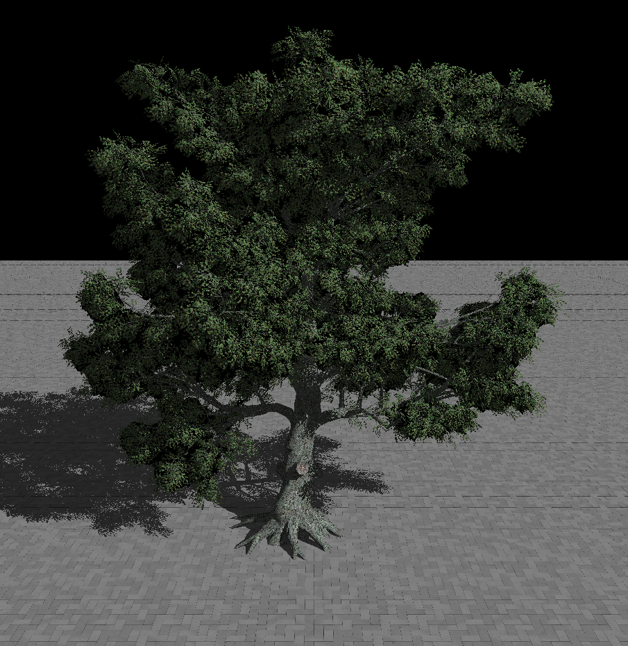

Breakfast Room，max depth=7，参考渲染时间 ~20min

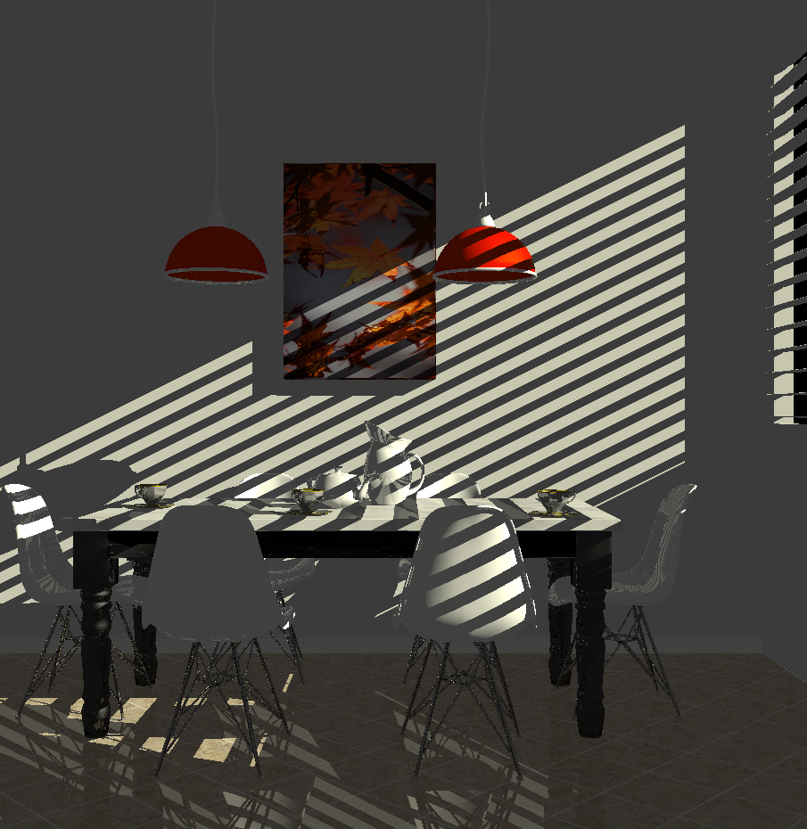

Sponza，max depth=7，参考渲染时间 ~20min

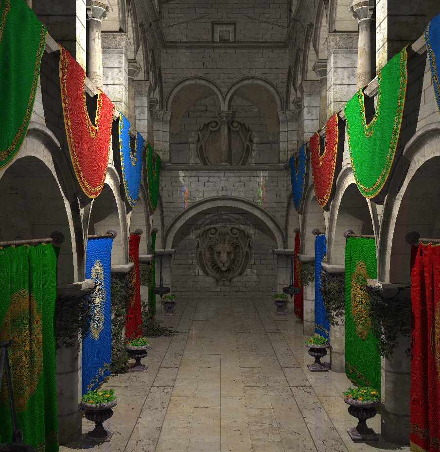

有条件的同学还可对比不同的反射次数、采样率对渲染结果的影响。
