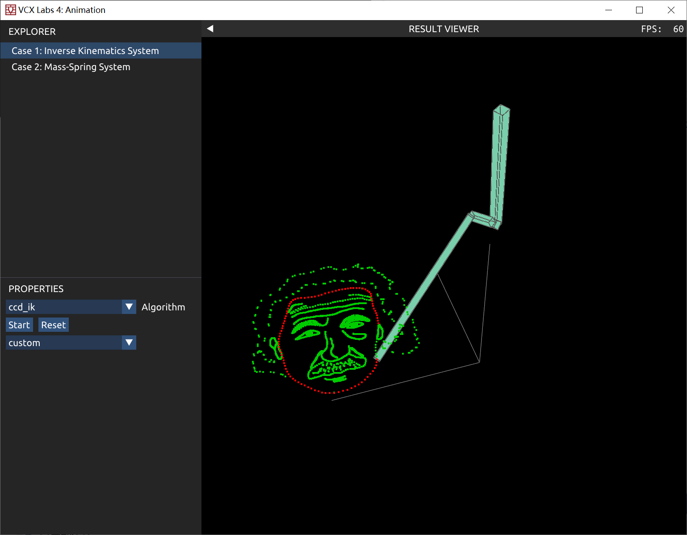
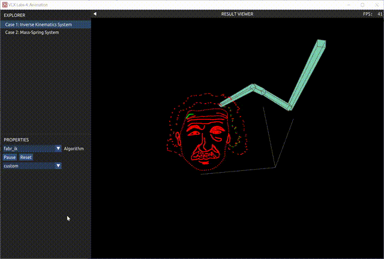
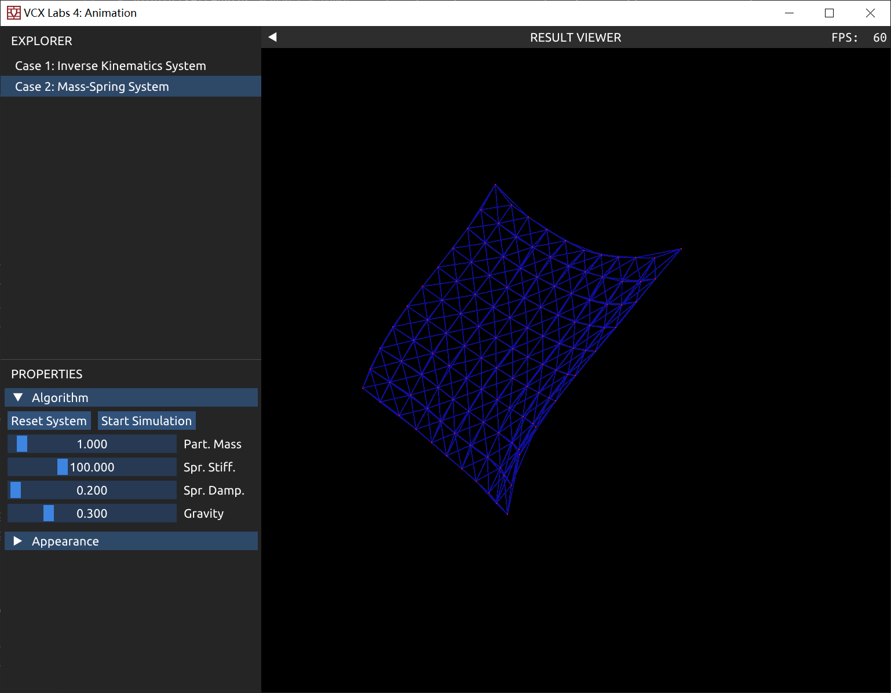

# 可视计算与交互概论 Tutorial for Lab 4 (Animation)

## Lab 4 Overview

本次 Lab 中，大家将会实现两种动画生成的算法：

1. 逆向运动学 (Inverse Kinematics)（[第十八章讲义](https://vcl.pku.edu.cn/course/vci/notes/18-animation-notes.pdf)18.2.3节）
2. 弹簧质点系统 (Mass-Spring System) （[第十七章讲义](https://vcl.pku.edu.cn/course/vci/notes/17-physics-notes.pdf)17.1节）

## 评分

请提交实现完成的 `tasks.cpp` 文件，以及为本次 lab 写一份报告，包含实现的思路以及效果图。注意：对其他源文件的修改不会在批改时生效，助教批改时只关注 `tasks.cpp` 文件的改动。

Lab 按每个 Task 的完成情况单独给分。本次 lab 一共需要实现 2 个 Task，4 + 3 = 7 分（其中 Task 1 包含额外的 bonus 任务 1 分）；此外每个 Task 可能要求在报告中回答问题，这些问题所占的分数已包含在 Task 中，报告再占 1 分，因此合计 8 分（另有 bonus 1 分）。

> Bonus 分数可以用来抵消全部 5 个 lab 中非 Bonus 部分的扣分（例如未能完成某个困难 Task）。

## Task 1: Inverse Kinematics (4', bouns=1')

### 代码说明

作业预期结果如图所示。





逆向运动学：给定一个机械臂末端位置，求解出每个关节的旋转角度。代码框架中，使用四元数进行旋转操作。
可以通过 Eigen 或 glm 库进行数学运算（旋转，向量运算等）。

`IKSystem ik` 给出了机械臂关节的相关信息，以下列出会用到的属性和方法：

- `ik.JointLocalOffset` ：表示一个关节相对于父关节的平移量；
- `ik.JointLocalOffset[0]` ：表示根关节(root)的全局位置；
- `ik.JointOffsetLength` ：表示每个关节的长度；
- `ik.JointLocalRotation` ：表示每个关节的局部旋转；
- `ik.JointGlobalRotation` ：表示每个关节的全局旋转；
- `ik.JointGlobalPosition` ：表示每个关节的全局位置；
- `ik.NumJoints()` ：返回关节的数量；
- `ik.EndEffectorPosition()` ：返回末端关节的全局位置。

### Sub-Task 1 (0.5'):
实现前向运动学 (forward kinematic) 算法。程序入口在 `tasks.cpp` 中 ForwardKinematics 函数，参数 `StartIndex` 给出了前向更新从第几个关节开始的信息。

### Sub-Task 2 (1'):
实现 CCD IK 算法。程序入口在 `tasks.cpp` 中 `InverseKinematicsCCD` 函数，参数 `EndPosition` 给出了目标的末端位置。

### Sub-Task 3 (1'):
实现 FABR IK 算法。程序入口在 `tasks.cpp` 中 `InverseKinematicsFABR` 函数，参数 `EndPosition` 给出了目标的末端位置。

### Sub-Task 4 (0.5'):
使用 IK 绘制自定义曲线。程序入口在 `tasks.cpp` 中 `BuildCustomTargetPosition` 函数。
模仿原有的函数进行修改，返回类型为 `std::shared_ptr<std::vector<glm::vec3>>` ，自定义绘制曲线（比如数字，姓名首字母缩写等）。

#### Sub-Task 4.1 (bonus=0.5')
在通过函数生成轨迹时，会出现采样点不均匀的地方。比如在这个图里，头像的头发非常稀疏。有无可能让采样点更加均匀？

#### Sub-Task 4.2 (bonus=0.5')
输入一张简单的 2D 图像（比如 MNIST 手写数字），提取图像的骨架，作为 IK 的目标轨迹。

在阅读和补全代码的过程中，请在报告中回答下面的问题 (1')

1. 如果目标位置太远，无法到达，IK 结果会怎样？
2. 比较 CCD IK 和 FABR IK 所需要的迭代次数。
3. （选做，只提供大概想法即可）由于 IK 是多解问题，在个别情况下，会出现前后两帧关节旋转抖动的情况。怎样避免或是缓解这种情况？

## Task 2: Mass-Spring System (3')

`tasks.cpp` 中已经实现了一个显式 Euler 的弹簧质点系统。该方法的稳定性很差。为了达到稳定实时模拟的要求，你需要将它改写为隐式 Euler。最终实现的单帧效果如下（一面在重力作用下飘动的布料）：



由于求解线性系统需要使用到 Eigen 库，我们给出了辅助函数来进行 Eigen 数组和矩阵的生成和转化以及线性系统的求解：

+ `glm2eigen` ：将 `std::vector<glm::vec3>` 转化为铺平后的一维 Eigen 向量；
+ `eigen2glm` ：上述操作的逆过程；
+ `ComputeSimplicialLLT` ：求解 `Ax=b` 的方程，返回 `x` ；
+ `CreateEigenSparseMatrix` ：创建一个 `n` 行 `n` 列的稀疏矩阵，参数 `triplets` 给出了一系列三元组，每个三元组形如 `(row, col, val)` 描述了矩阵在 `row` 行 `col` 列的位置（索引从 0 开始）具有值 `val` ，未给出值的位置视为 0 ，这里给出一个创建三元组的例子。

```cpp
std::vector<Eigen::Triplet<float>> triplets;
triplets.emplace_back(0, 1, 1.0f);
triplets.emplace_back(2, 2, 2.0f);
auto A = CreateEigenSparseMatrix(3, triplets);

// [[ 0 1 0 ]
//  [ 0 0 0 ]
//  [ 0 0 2 ]]

```